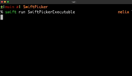

# SwiftPicker


[](https://opensource.org/licenses/MIT)

SwiftPicker is a Swift Package Manager library that provides interactive command-line picker functionality for Swift applications. It supports single and multiple item selection with terminal-based UI using ANSI escape sequences.

## Table of Contents

- [Features](#features)
- [Installation](#installation)
- [Quick Start](#quick-start)
- [Protocol Architecture](#protocol-architecture)
- [Usage Examples](#usage-examples)
  - [Single Selection](#single-selection)
  - [Multi-Selection](#multi-selection)
  - [Error Handling](#error-handling)
- [Backstory](#backstory)
- [Testing](#testing)
- [Acknowledgements](#acknowledgements)
- [Contributing](#contributing)
- [License](#license)

## Features

- **Single & Multiple Selection**: Interactive selection from lists with keyboard navigation
- **Protocol-Oriented Design**: Flexible architecture with composable protocols
- **Custom Types**: Any type can conform to `DisplayablePickerItem` for picker support
- **Input & Permission Handling**: Built-in text input and yes/no confirmation methods
- **ANSI Terminal Support**: Enhanced UI with cursor control and screen management
- **Error Handling**: Comprehensive error handling with `SwiftPickerError` enum
- **Modern Swift**: Built with Swift 5.9+ using contemporary patterns
- **Comprehensive Testing**: 60+ tests ensuring reliability and behavior validation

## Installation

To use SwiftPicker in your Swift project, add it as a dependency in your `Package.swift` file:

```swift
    .package(url: "https://github.com/nikolainobadi/SwiftPicker.git", from: "1.0.0")
```

## Quick Start

```swift
import SwiftPicker

// Create a picker instance
let picker = InteractivePicker()

// Simple text input
let name = picker.getInput(prompt: "What's your name?")
print("Hello, \(name)!")

// Yes/no confirmation
if picker.getPermission(prompt: "Continue?") {
    // User confirmed
}

// Single selection
let colors = ["Red", "Green", "Blue"]
if let color = picker.singleSelection(title: "Pick a color:", items: colors) {
    print("You chose: \(color)")
}

// Multiple selection
let hobbies = ["Reading", "Gaming", "Cooking", "Sports"]
let selected = picker.multiSelection(title: "Your hobbies:", items: hobbies)
print("Selected \(selected.count) hobbies")
```

## Protocol Architecture

SwiftPicker uses a protocol-oriented design for maximum flexibility:

```swift
// Unified interface combining all capabilities
let picker: CommandLinePicker = InteractivePicker()

// Or use individual protocol capabilities
let inputHandler: CommandLineInput = picker
let permissionHandler: CommandLinePermission = picker
let selectionHandler: CommandLineSelection = picker
```

### Core Protocols

- **`CommandLinePicker`**: Composition of all command-line interaction protocols
- **`CommandLineInput`**: Text input methods (`getInput`, `getRequiredInput`)
- **`CommandLinePermission`**: Yes/no confirmation methods (`getPermission`, `requiredPermission`)
- **`CommandLineSelection`**: Single/multi selection methods (`singleSelection`, `requiredSingleSelection`, `multiSelection`)
- **`DisplayablePickerItem`**: Items that can be displayed (requires `displayName: String`)
- **`PickerPrompt`**: Prompt messages (requires `title: String`)

### Backward Compatibility

For existing code, deprecated aliases are available:

```swift
// Deprecated but still functional
let picker: Picker = InteractivePicker()  // Use CommandLinePicker instead
let oldPicker = SwiftPicker()             // Use InteractivePicker() instead
```

## Usage Examples


### Single Selection


```swift
import SwiftPicker

// Use the modern InteractivePicker struct
let picker = InteractivePicker()
let title = "Choose Your Favorite Programming Language"
let sampleList = ["Swift", "Python", "JavaScript", "C#", "Java", "Go", "Ruby", "Kotlin"]

// Select a single item
if let selection = picker.singleSelection(title: title, items: sampleList) {
    print("You selected: \(selection)")
}
```

### Multi-Selection
To use custom items in SwiftPicker, conform your type to the `DisplayablePickerItem` protocol. And don't worry about long lists, SwiftPicker can handle scrolling!



```swift
struct Movie {
    let title: String
    let director: String
}

// Conform to DisplayablePickerItem protocol
extension Movie: DisplayablePickerItem {
    var displayName: String {
        return "\(title) (\(director))"
    }
}

let marvelMovies = [
    Movie(title: "Iron Man", director: "Jon Favreau"),
    Movie(title: "The Avengers", director: "Joss Whedon"),
    Movie(title: "Black Panther", director: "Ryan Coogler")
]

let title = "Select Your Favorite Marvel Movies"
let results = picker.multiSelection(title: title, items: marvelMovies)
print("Selected \(results.count) movies")
```

### Error Handling

SwiftPicker provides throwing methods for required inputs and selections:

```swift
// Required text input with validation
do {
    let input = try picker.getRequiredInput(prompt: "Please provide your name:")
    print("Hello, \(input)!")
} catch SwiftPickerError.inputRequired {
    print("Input cannot be empty.")
}

// Required permission (throws if user denies)
do {
    try picker.requiredPermission(prompt: "Do you want to continue?")
    print("Proceeding...")
} catch SwiftPickerError.selectionCancelled {
    print("Operation cancelled.")
}

// Required selection (throws if user quits)
do {
    let languages = ["Swift", "Python", "JavaScript"]
    let selection = try picker.requiredSingleSelection(title: "Choose a language:", items: languages)
    print("You selected: \(selection)")
} catch SwiftPickerError.selectionCancelled {
    print("No selection made.")
}

// Optional selection (returns nil on quit, no error)
let colors = ["Red", "Green", "Blue"]
if let color = picker.singleSelection(title: "Pick a color:", items: colors) {
    print("Selected: \(color)")
} else {
    print("No selection made.")
}
```
## Backstory
I think programming is one of the few fields where 'specialized laziness' is actually a superpower. While building custom command line tools may seem like a daunting task to some, I see it as a way to never have to waste time on the boring portions of my workflow ever again. But I'm an iOS developer. When I write code, I prefer to do it in Swift. Unfortunately, there aren't many Swift libraries for command line tools. And I feel like it's a catch-22 because nobody wants to write libraries for the command line using Swift because there aren't many libraries out there to help them, and there aren't many libraries out there because nobody wants to write them, and round and round we go.

SwiftPicker is simply my contribution to the (hopefully growing) ecosystem of Swift command line tools. It's easy to use, relatively lightweight, and best of all, it helps me write more command line tools to feed my 'specialized laziness'.

## Testing

SwiftPicker includes comprehensive test coverage with 60+ tests using the Swift Testing framework:

```bash
# Run all tests
swift test

# Run specific test suite
swift test --filter EdgeCaseTests

# Run with verbose output
swift test --verbose
```

### Test Coverage Areas

- **Public API Testing**: All user-facing methods and protocols
- **Error Handling**: Input validation and cancellation scenarios  
- **Edge Cases**: Empty lists, quit behavior, boundary conditions
- **Protocol Conformance**: Custom types and protocol implementations
- **Integration Testing**: End-to-end picker workflows
- **Performance Testing**: Large datasets and navigation efficiency

The test suite ensures reliability and validates behavior across different scenarios, making SwiftPicker production-ready.

## Acknowledgements

This project was inspired by [How to Make an Interactive Picker for a Swift Command-Line Tool](https://www.polpiella.dev/how-to-make-an-interactive-picker-for-a-swift-command-line-tool/) by Pol Piella Abadia. Special thanks for the great tutorial.

## Contributing
Any feedback or ideas to enhance SwiftPicker would be well received. Please feel free to [open an issue](https://github.com/nikolainobadi/SwiftPicker/issues/new) if you'd like to help improve this swift package.

## License

SwiftPicker is released under the MIT License. See [LICENSE](LICENSE) for details.
